# 1.miner node
## 1.build x86
```shell
go build -x -tags main github.com/ds/depaas/cmd/miner
```
### run
```shell
./miner -data /mnt -size 100GB 
```
## 1.build arm64
```shell
sudo apt install gcc-8-aarch64-linux-gnu
```
```shell
CC="aarch64-linux-gnu-gcc-8" \
CXX="aarch64-linux-gnu-gcc-8" \
CGO_ENABLED=1 GOOS=linux GOARCH=arm64 \
go build -x -o arm64-miner -tags main github.com/ds/depaas/cmd/miner
```
# Architecture

